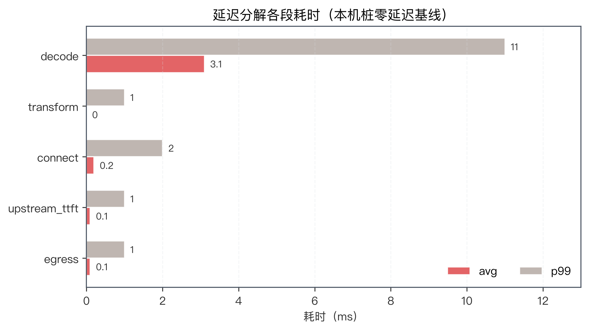
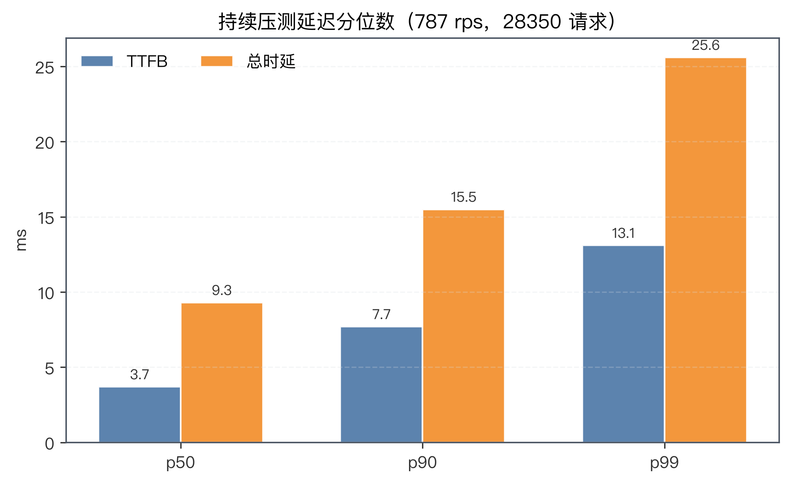
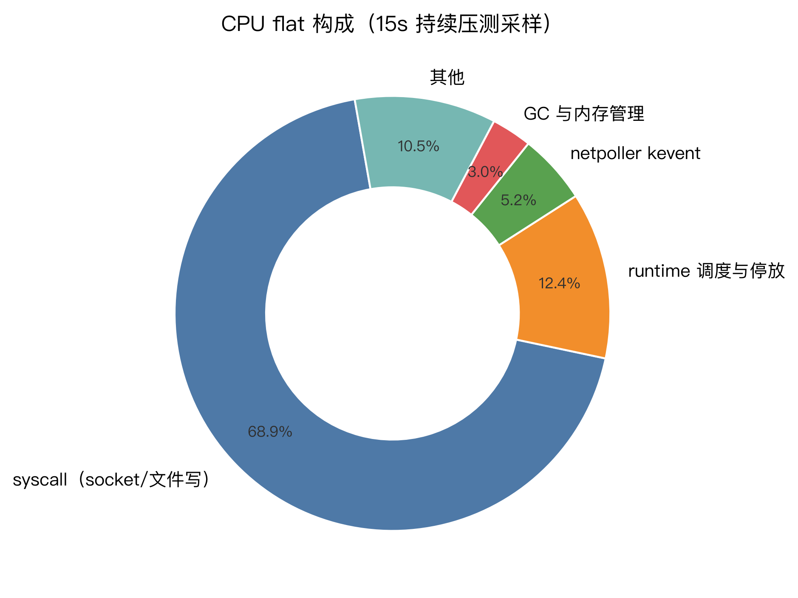

# 性能剖析与基准工作流

本文档登记 devin-2api 的性能测量工具链：怎么采剖析数据、怎么跑可复现的负载、延迟分解字段怎么读、以及优化结果怎么用统计方法验收。

## 工具链总览

| 工具              | 位置                                | 用途                                                                                                                     |
| ----------------- | ----------------------------------- | ------------------------------------------------------------------------------------------------------------------------ |
| pprof/fgprof 端点 | `debug.pprof_listen` 配置的独立监听 | 线上实例的 CPU/heap/goroutine/block/mutex 剖析 + fgprof 墙钟剖析[^fgprof]                                                |
| 负载发生器        | `cmd/loadtest`                      | 对任意实例发并发 /v1/chat/completions 请求，报告 TTFB/总时延分位数与吞吐                                                 |
| 上游桩            | `cmd/upstreamstub -scenario=stream` | 本地 Connect-RPC GetChatMessage 桩，可控 delta 数/大小/间隔/首帧延迟，把上游网络从测量中剥离                             |
| 快照编排          | `scripts/perf-snapshot.sh`          | 一键：建桩 + 起实例 + 压测 + 抓 pprof/fgprof + 聚合延迟分解，产物落 `outputs/perf/<ts>/`                                 |
| 微基准基线        | `scripts/bench.sh`                  | 自动发现含 `func Benchmark` 的包，`-count=N -benchmem` 输出落 `outputs/bench/<label>.txt`，供 benchstat 对比[^benchstat] |
| PGO               | `cmd/devin-2api/default.pgo`        | `go build` 自动拾取的剖面引导优化文件[^pgo]                                                                              |

`outputs/perf/` 与 `outputs/bench/` 已 gitignore，属可再生成本地产物。

## pprof 端点

`config.yaml` 里设 `debug.pprof_listen: "127.0.0.1:6060"` 后，进程在该地址起一个**独立 mux** 的 HTTP 服务，与主端口隔离：无鉴权，只应绑回环地址，跨机用 `ssh -L` 转发。该字段可热重载——`POST /admin/config/reload` 换绑或置空关闭，bind 失败不致命且同值 reload 会重试。

端点清单（GET）：

- `/debug/pprof/`（索引）及 `cmdline`/`profile`/`symbol`/`trace` 等标准项
- `/debug/pprof/profile?seconds=N` CPU 剖析；`/debug/pprof/heap`、`goroutine`、`allocs`、`block`、`mutex`、`threadcreate`
- `/debug/fgprof?seconds=N` 墙钟剖析——把 I/O 等待、锁等待也计入，适合本服务这种 syscall 占比高的 I/O 型进程

启用时进程同步打开 `runtime.SetBlockProfileRate(1ms)` 与 `runtime.SetMutexProfileFraction(10)`，block/mutex 采样带少量持续开销，这是只在显式配置后开启的原因。

抓样：`go tool pprof -http=:0 'http://127.0.0.1:6060/debug/pprof/profile?seconds=15'`，或先 `curl -o cpu.pb.gz` 再 `go tool pprof -http=:0 cpu.pb.gz`；fgprof 产物同样喂给 `go tool pprof`。

## 延迟分解字段

debuglog 给每个请求记录 6 个时间点（相对请求开始的毫秒数，未到达记 `-1`/缺省）：

| meta.json 字段      | 含义                                                                 | 埋点位置                                         |
| ------------------- | -------------------------------------------------------------------- | ------------------------------------------------ |
| `request_ready_ms`  | 请求体解码、消息投影、上游请求构造全部完成，泵协程即将调 `Stream()`  | `startStreamPump` 协程入口                       |
| `upstream_sent_ms`  | 首个真实 `GetChatMessage` RPC 发出（CAS 幂等，重试时 sent 留在首发） | `attemptRunner.send` 循环内 `NoteUpstreamSend()` |
| `upstream_open_ms`  | 上游流建立成功（响应头/首帧通道就绪）                                | `GetChatMessage` 返回后                          |
| `first_upstream_ms` | 第一个真实上游事件到达（本地合成 Start 不计）                        | 泵协程 `Recv` 后                                 |
| `upstream_done_ms`  | 泵协程收完上游事件流（终态 EOF/错误/取消）；`Stream()` 未建成则缺席  | 泵协程退出时（defer）                            |
| `first_client_ms`   | 第一个协议内容字节写给客户端（SSE 保活注释不计）                     | `streamWriter.writeContent`                      |

这些字段把端到端延迟切成段，段名即两字段之差：`decode`（0→ready）、`transform`（ready→sent，含限流闸门排队）、`connect`（sent→open，上游建连）、`upstream_ttft`（open→首事件，上游首字延迟）、`egress`（编码 + 写客户端）。`egress` 的基线按响应形态分：流式是 `first_client − first_upstream`（首事件→首字节）；非流式攒完整条上游流才一次性写出，`first_client − first_upstream` 量到的是剩余上游时长而非出口延迟，须用 `first_client − upstream_done`（流末→首字节）。

`transform` 段内另有两个相位字段（meta.json 专有，未发生即缺席）：`models_fetch_ms` 是目录确保（`ensureCatalog`→`ListModels`）的墙钟毫秒数——真实拉取与等待他人在飞拉取都计入，缓存命中≈0；`assign_model_ms` 是 `AssignModel` 调用的墙钟毫秒数（含共享 flight 陪等），仅 router uid 请求出现。两者量的都是闸门排队之前的上游解析停滞——闸门指标看不到这段，批量停滞只能靠这里直接读出。

落库位置：`debug_files` 表 `<dir>` 键下的 `meta.json` 行（单请求详情，`/admin/debug-logs/{id}/file/meta.json` 或 `sqlite3` 直查）与 `logs` 表的同名可空列（批量 SQL 聚合）。`perf-snapshot.sh` 的收尾步骤自动按段求 avg/p50/p90/p99。

`logs` 表做命中率聚合时的口径陷阱：必须过滤 `result='completed' AND input_tokens+cache_read_tokens>0`——rate_gate 快败、客户端断连等 0-token 行与 failed 高度重合，不过滤会被当 miss 污染比率；上游 `cache_creation` 恒 0，判活只看 `cache_read`。流级画像（静默间隔→命中率、miss 归因）用 `scripts/index-stream-stats.py`（读 `devin-2api.db`）。

`connect` 段另带连接画像：`upstream_conn_reused`/`upstream_conn_idle_ms`（`logs` 表 `conn_reused`/`conn_idle_ms` 列，三态可空）记录成功建流那次发送是否复用了 idle 连接（httptrace `GotConn`）。`connect` 偏高时它是分水岭：`reused=true` 说明大头在上游响应头延迟（上游排队/思考，本地可优化空间小），`reused=false` 则是 TCP+TLS 握手成本（本地保温/复用策略的覆盖问题）。

读法：本机桩（interval=0）下 decode/transform 是主项属正常——桩没有网络与思考延迟，代理自身开销被放大显示；真实上游下 `connect`+`upstream_ttft` 通常占绝对大头，此时分解的价值是确认 egress/transform 没有异常回退。



## 工作流

标准一轮优化测量：

```bash
# 1. 改前：微基准基线 + 一次完整快照（默认桩 200×32B delta、8 并发、25s 剖析）
scripts/bench.sh before
scripts/perf-snapshot.sh --out outputs/perf/before

# 2. 分析快照：cpu.pb.gz 看 self/cum 热点，fgprof.pb.gz 看墙钟，
#    segments.txt 看延迟分解，allocs 看分配大户
go tool pprof -http=:0 outputs/perf/before/cpu.pb.gz

# 3. 实施优化，改后重复测量
scripts/bench.sh after
scripts/perf-snapshot.sh --out outputs/perf/after

# 4. 统计验收：benchstat 给出 delta 与 p 值，p<0.05 才算有效改动
~/go/bin/benchstat outputs/bench/before.txt outputs/bench/after.txt
```

`perf-snapshot.sh` 常用参数：`--concurrency/--requests`（压测强度）、`--deltas/--delta-bytes/--interval/--ttfb`（桩的流形态）、`--profile-seconds`（剖析窗）、`--debug on|off`（debuglog 默认 on——测日志管道自身开销；`--debug off` 剥离该路径）。端口冲突或桩起不来会在前置检查直接报出。

注意两点测量卫生：基准进程的 slog 输出会混进 `go test` stdout 让 benchstat 无法解析，`internal/app/bench_perf_test.go` 已把日志阈值抬到 Error——新增基准若引入日志路径需同样处理；macOS 自带 bash 3.2 下脚本避免 `mapfile`、变量紧邻中文时用 `${var}` 花括号。

## PGO

`cmd/devin-2api/default.pgo` 被 `go build` 自动拾取（`go version -m <binary>` 可见 `-pgo=` 行），无需构建参数。剖面来自 stub 压测下的 15s CPU 样本，覆盖 SSE 编码、proto 解码、JSON 热路径。注意 `go test` 同样会拾取 default.pgo——低核数 runner（含 macOS CI）上 PGO 编译开销能把测试拖死，资源受限环境跑测试加 `-pgo=off`。

刷新流程：跑一轮 `perf-snapshot.sh`（或等价负载）→ `cp outputs/perf/<ts>/cpu.pb.gz cmd/devin-2api/default.pgo` → 提交。Go 文档建议把剖面随源码入库以保证可复现构建；负载形态显著变化时刷新一次即可，不必随每次提交更新。

## 已测基线（2026-09，本机 M 系）

供后续对比参照的数字，测量环境均为本机桩、非真实上游。配图由 `scripts/perf-charts.py` 生成（`uv run --with matplotlib scripts/perf-charts.py`），基线数据硬编码在脚本里，重测后改数据再跑一遍。

- 持续压测吞吐约 **787 rps**（28350 请求 / 36s，8 并发，0 错误）；TTFB p50 3.7ms、p99 ~11ms。
- 桩零延迟下延迟分解以 `decode` 段为主（avg 3.1ms / p99 11ms），`transform`/`egress` 毫秒级以下。
- CPU 剖面：`syscall` 占比约 69%——I/O 型服务特征；debuglog 管道是本服务最大的自加开销（每请求目录创建 ~16%、JSONL 文件操作 ~22% 的 cum），文件写字节量高于 socket 写。





- 分配剖面：`debuglog.AppendJSONL` 累计分配最大（每事件 RawMessage 重建记录体），其次为上游帧解码与 SSE 编码。
- 投影延迟求值（`evalDeferred`）经 benchstat 验收：`StreamEndToEnd` −15.3%（p=0.001）、`StreamEndToEndDebugLog` −6.9%（p=0.004），代价是每延迟事件一次闭包分配（+0.9~1.4% allocs/op）。

### 参考文献

[^pgo]: The Go Authors. Profile-guided optimization. go.dev/doc/pgo. [go.dev](https://go.dev/doc/pgo)

[^benchstat]: The Go Authors. benchstat — benchmark result comparison. golang.org/x/perf. [pkg.go.dev](https://pkg.go.dev/golang.org/x/perf/cmd/benchstat)

[^fgprof]: Felix Geisendörfer. fgprof — sampling profiler for on-CPU and off-CPU time. [github.com/felixge/fgprof](https://github.com/felixge/fgprof)
