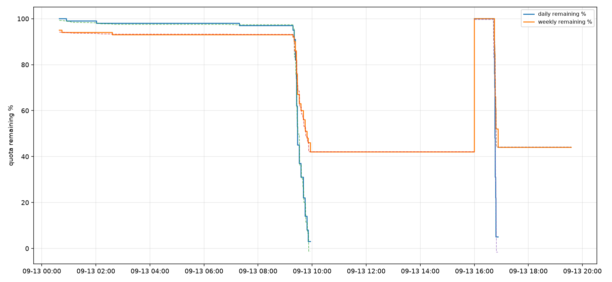

# Devin 配额计费模型

通过配额快照的整数翻转点与代理侧逐请求账单对齐，反推出的上游 Teams 座位计费公式与日/周额度大小。结论先行：

$$
\text{burn} = \big((t_{in}+t_{cw})\cdot p_{in} + t_{cr}\cdot p_{cached} + t_{out}\cdot p_{out}\big)/10^6 \quad \text{（目录价美元）}
$$

- **日额度 ≈ $14.1，周额度 ≈ $25~27**（目录价口径，周 ≈ 1.8×日；新窗口实测 $25.2/100pts）；
- **cache_write 按 ~1.0× input 价计费**（拟合隐含价 $9.5–10.7/Mtok，fable input 价 $10），不是 Anthropic 惯例的 1.25×[^anthropic-cache]；
- `credit_multiplier` 与实际扣费无关（同为 mult=175 的调用燃烧量差 200 倍）；
- catalog 无价格维的 free 档模型（swe-2-max 等）燃烧低于检出限——日级 ~1-2pts 的未归因残差大部分可由 int-floor 与入账延迟解释，但不能排除存在微量燃烧；
- 日/周额度任一归零后对应字段返回 null，付费模型被上游 `failed_precondition` 拒，free 档不受影响。

## 数据来源

三路数据：

| 数据       | 位置                                                                                                                                                        | 说明                                                                                                                                       |
| ---------- | ----------------------------------------------------------------------------------------------------------------------------------------------------------- | ------------------------------------------------------------------------------------------------------------------------------------------ |
| 配额快照   | `scripts/quota/poll.sh` 每 30s 打一次 `GetUserStatus`[^connect]，记 `daily/weeklyQuotaRemainingPercent`；另有 daemon 每 5 分钟一条写 `quota_samples` 表保底 | 本机采集示例：`outputs/quota-probe-2026-09-13.jsonl`                                                                                       |
| 逐请求摘要 | `devin-2api.db` 的 `logs` 表                                                                                                                                | 每个代理请求一行：模型、`input/output/cache_read/cache_write_tokens`、result、毫秒级时间戳                                                 |
| 模型目录   | `GetCliModelConfigs` 缓存快照（面板 `/admin/model-registry` 各行的 `catalog` 字段透出同一份）                                                               | 191 个模型的 `credit_multiplier`、cost_tier、展示价（in/cached/out，无 cache_write 维）；本机示例：`outputs/model-catalog-2026-09-13.json` |

配额字段是 **int32 整数百分比**且向下取整——1% 的粒度决定了只能用"翻转点"做方程：两次相邻采样间掉了 k 个点，即该窗口真实燃烧量落在 $((k-1)D, (k+1)D)$，D 为每点对应的美元数。上游入账还有 ~1–3 分钟延迟，所以拟合时把请求时间戳整体前移一个 lag 再扫参。

## 拟合方法

逐请求的"真实账单"不可见，可见的只有配额百分比的阶梯下降。做法是把每次翻转当成一个区间约束：窗口 $(t_i, t_{i+1}]$ 内掉 $k$ 点，则 $\sum$ 该窗内请求的 burn $+ \varepsilon_{\text{入账延迟}} \in ((k-1)D,(k+1)D)$。

实际操作中等价更稳的形式：对候选计费函数 $b(\text{request})$，构造累计燃烧曲线 $B(t)=\sum_{t_c\le t-\delta} b(c)$，在每个重置窗口内对「已消耗百分点 vs $B(t)$」做带截距的最小二乘。斜率的倒数 $1/\hat\beta$ 就是 1% 对应的账单额，乘以 100 得窗口额度。**两个独立窗口（16:00 重置两侧）用同一公式各自拟合，斜率一致才算数**——这是排除"巧合拟合"的关键检验。

## 被否掉的假设

探索过程中三个假设依次被数据杀死，每个的死法都值得记录：

1. **固定倍率计费**（每请求烧 `credit_multiplier` 单位，与 token 无关）。上午的 fable-5-1-medium 连打 13 发（mult 全=175，est$ 却从 $0.004 到 $0.80 差 200 倍），掉点幅度跟 $ 走不跟次数走；且全日累计 14K mult-units 对应 97 个日点 → D≈145 u/点，但前一天 79 个 mult=75 的 opus 探测调用按此应掉 29 点，实测几乎没动。SSE 比 $ 模型差 46 倍。
2. **不含 cache_write 的目录价计费**。单窗口内 R²≈0.99 看似很好，但跨窗口斜率差 3.3 倍（窗口 B 每 $ 燃烧是 A 的 3.3 倍）。一度怀疑有外部用量或额度缩水——实际原因是 B 的 19 个 agentic 调用写了 118 万 cache_write token（每轮重写全上下文），而 est$ 公式没算它。
3. **swe-2-max 隐性计费**。窗口 B 内有 1,050 个 swe 调用，若每个扣哪怕 0.05 点就能解释缺口——但把 swe 计数/输出/cache 加进回归，系数全部 ~0 或为负（噪声），且前一天 1.3 万个 swe 调用对应几乎零漂移。

补上 cache_write 后全部收敛：

| 窗口                  | 通道   | 斜率 (pts/$) | 推出额度 | R²    |
| --------------------- | ------ | ------------ | -------- | ----- |
| A（16:00–次日 16:00） | daily  | 7.081        | $14.12   | 0.994 |
| A                     | weekly | 3.668        | $27.26   | 0.999 |
| B（次日 16:00–）      | daily  | 7.168        | $13.95   | 0.955 |
| B                     | weekly | 3.949        | $25.32   | 0.994 |

日额度两窗口差 1.2%，周差 7%。`in+out+cr+cw` 全自由权重回归也收敛到 cw 主导（cw≈$10.7/M 隐含价），但因为当天燃烧几乎全是 fable-5-1-medium 单一模型，各 token 类型间有共线性，权重拆分不如"目录价 + cw@input 价"先验稳健——后者同时是最经济的解释。



## 行为层面的附带发现

- **重置**：`dailyQuotaResetAtUnix` 与 `weeklyQuotaResetAtUnix` **各自**指向下一次重置——daily 每日 16:00 +08，weekly 每周日 16:00 +08，仅周日重合产生双重置（2026-09-13 观测值：daily=09-15 16:00 ≠ weekly=09-20 16:00，即"同一时刻"是误读）。"周额度"实为 ~1.8×日额度的并行预算，不是滚动 7 天。注意 weekly 开窗首采可以远低于 100%：09-13 16:00 周窗口开启后 ~3h 首采即 44%（新窗口预先少了 56 点），机制未确认——座位在代理之外被使用、或开窗语义并非回满皆有可能，拟合时不要把「新窗口」当「回满 100%」。
- **归零**：daily 烧穿后 `dailyQuotaRemainingPercent` 直接变 null；付费调用在 connect 阶段收到 400 `failed_precondition: Your daily usage quota has been exhausted`（可引导至 app.devin.ai 购买 on-demand）[^devin-quota]；free 档（swe-2-max）照常服务，归零后 242 个调用全部 completed。weekly 归零同语义：`weeklyQuotaRemainingPercent` 变 null，付费档同样被 `failed_precondition` 拦（文案换成 weekly），free 档继续服务——两额度是并行预算，任一归零都拦付费档。注意 null 的回补滞后于重置：实测 daily null 自 09-13 ~12:25 起持续 ~27h、跨过 09-13 16:00 重置未回补、直到 09-14 16:00 重置才恢复 96——与"每日 16:00 重置即回满"的字面语义不符，疑似与 overage 负债状态联动。
- **失败计费**：配额拒绝（`failed_precondition`）不产生燃烧已证实（请求没真正执行）；但**已产出 token 的断连/流失败照常计费**——7 例实测，含一例 fable 断连携 `cache_write=89937`（≈$0.9 目录价）在入账中可见。
- **入账延迟**：~1–3 分钟，且偶发 10 分钟级延迟。
- `overageBalanceMicros` **不是**静态占位：早期观测（09-13）记为恒 -500354，后续（09-18）yanjian 移至 -1105665（-$1.11）、randall 为 -81233（-$0.08），两号取值各异且随时间移动——疑似随座位状态变化而非代理侧燃烧，机制未确认；现已逐样本落 `quota_samples.overage_balance_micros` 持续观测（未开 auto-reload）。`acuConsumed/acuLimit` 恒 null——Teams 座位的配额不走 ACU 通道。
- `GetQuotaUsageInternal`（能直接返回日/周 usage_micros/limit_micros）需要 admin secret，普通会话 token 拿不到，所以只能反推。

## 复现

```bash
# 1. 加密采集（独立于代理进程，token 从配置目录的 config.yaml 读）
nohup scripts/quota/poll.sh 30 /tmp/quota.jsonl &

# 2. 正常用付费模型产生燃烧（logs 表自动记录）

# 3. 拟合（uv 起隔离环境；catalog 也可给 http://localhost:<port>/admin/model-registry --key <面板密码>）
#    logs 表在状态目录的 devin-2api.db 里（平台路径见 deployment.md），
#    先导出 JSONL 再喂 fit.py：
sqlite3 -json <状态目录>/devin-2api.db \
  "SELECT * FROM logs" | jq -c '.[]' > /tmp/index.jsonl
uv run --with numpy --with matplotlib scripts/quota/fit.py \
  --status outputs/quota-probe-2026-09-13.jsonl \
  --index /tmp/index.jsonl \
  --catalog outputs/model-catalog-2026-09-13.json \
  --out outputs/quota-fit.png
```

注意点：`fit.py` 按 daily 字段回升切窗口；daily 归零后样本截断（`censor`），否则 0 值平台会拉歪斜率。想进一步分离各 token 类型的独立权重，需要用价格构成差异大的模型（如 kimi-k3-max $3/$15、mult=9）跑大 output 调用。

## 对 est_cost 的修正

面板侧 est_cost 原本漏算 cache_write（字段采集了但没进公式），已按本结论修复为 `(input + cache_write)·p_in`（commit 78b6ede；现实现见 `internal/ccpanel/logs.go` 的 `logCostBreakdown` 与 `internal/ccpanel/dashboard.go` 的 `cellCostNG`）。修复后面板 est_cost 与配额实际燃烧同口径。

### 参考文献

[^anthropic-cache]: Anthropic. Prompt caching pricing（cache write 按 1.25× input、cache read 按 0.1× input 计价）. [Claude API docs](https://docs.claude.com/en/docs/build-with-claude/prompt-caching).

[^connect]: Connect RPC. Connect protocol over HTTP/JSON. [connectrpc.com/docs/protocol](https://connectrpc.com/docs/protocol/).

[^devin-quota]: Devin app.devin.ai. Usage & billing（on-demand usage / auto-reload）. <https://app.devin.ai/settings/usage>.
